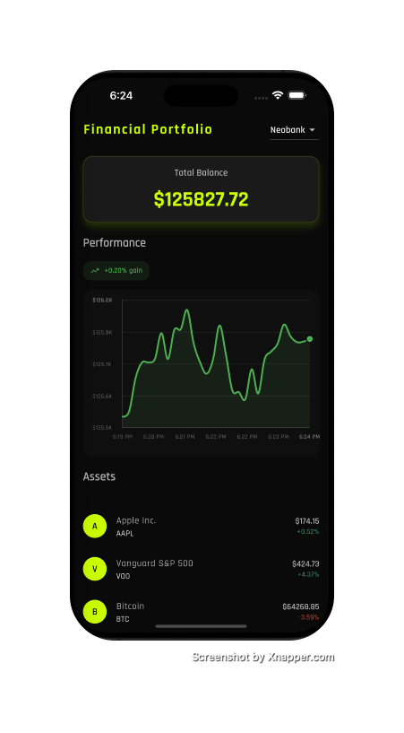
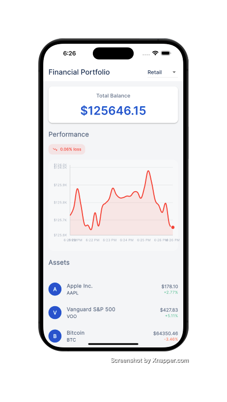

# Financial Portfolio

![coverage][coverage_badge]
[![style: very good analysis][very_good_analysis_badge]][very_good_analysis_link]
[![License: MIT][license_badge]][license_link]

Financial Portfolio App - An application to visualize and manage investment portfolios.

---
## Screenshots 📸

<table>
  <tr>
    <td><strong>Dark Theme (Neobank)</strong></td>
    <td><strong>Light Theme (Retail Banking)</strong></td>
  </tr>
  <tr>
    <td></td>
    <td></td>
  </tr>
</table>

---

## Prerequisites 📋

Before running the application, make sure you have the following installed:

| Tool | Minimum Version | Verify Installation |
|------|----------------|---------------------|
| Flutter | 3.35.0+ | `flutter --version` |
| Dart | 3.9.0+ | `dart --version` |
| CocoaPods (macOS/iOS) | Latest | `pod --version` |
| Xcode (macOS/iOS) | 15.0+ | `xcodebuild -version` |
| Android Studio (Android) | Flamingo+ | - |

---

## Installation 🔧

### 1. Clone the repository

```sh
git clone <repository-url>
cd financial_portfolio
```

### 2. Install Flutter dependencies

```sh
flutter pub get
```

### 3. Generate code (freezed, l10n, etc.)

```sh
dart run build_runner build --delete-conflicting-outputs
```


## Running the Application 🚀

This project contains 3 flavors:

- **development** - Development environment
- **staging** - Testing environment
- **production** - Production environment

### Run commands

```sh
# Development
flutter run --flavor development --target lib/main/main_development.dart

# Staging
flutter run --flavor staging --target lib/main/main_staging.dart

# Production
flutter run --flavor production --target lib/main/main_production.dart
```

### Run on specific device

```sh
# List available devices
flutter devices

# Run on a specific device
flutter run -d <device_id> --flavor development --target lib/main/main_development.dart
```


---

## Supported Platforms 📱

| Platform | Supported |
|----------|-----------|
| iOS | ✅ |
| Android | ✅ |
| Web | ✅ |
| macOS | ✅ |
| Windows | ✅ |

---

## Project Architecture 🏗️

The project follows **Clean Architecture** with a **feature-first** approach:

```
lib/
├── app/                    # App configuration
├── l10n/                   # Internationalization
├── main/                   # Entry points per flavor
├── portfolio/              # Feature: Portfolio
│   ├── bloc/               # State management
│   ├── view/               # Pages
│   └── widgets/            # Feature-specific widgets
└── theme_selector/         # Feature: Theme selector

packages/
├── app_ui/                 # Design system and UI components
├── portfolio_api/          # Data layer (API)
└── portfolio_repository/   # Repository layer
```

---

## Running Tests 🧪

### Run all tests

```sh
flutter test
```

### With coverage

```sh
flutter test --coverage
```

---

## Working with Translations 🌐

This project uses [flutter_localizations][flutter_localizations_link] for internationalization.

### Adding new strings

1. Open `lib/l10n/arb/app_en.arb`
2. Add the new key/value:

```arb
{
    "@@locale": "en",
    "portfolioTitle": "My Portfolio",
    "@portfolioTitle": {
        "description": "Title of the portfolio page"
    }
}
```

3. Add translation in `lib/l10n/arb/app_es.arb`

4. Generate localizations:

```sh
flutter gen-l10n --arb-dir="lib/l10n/arb"
```

---

## Features ✨

### Real-time Portfolio Tracking
- Live updates every 10 seconds
- Dynamic asset price changes
- Real-time balance calculations

### Interactive Chart
- Sliding window of last 30 data points
- Performance indicators (gain/loss %)
- Date and value labels on axes
- Interactive tooltips with detailed information
- Color-coded based on performance (green for gains, red for losses)

### Theme Support
- Light theme (Retail Banking)
- Dark theme (Neobank)
- System theme support

### Multi-language Support
- English (en)
- Spanish (es)

---


[coverage_badge]: coverage_badge.svg
[flutter_localizations_link]: https://api.flutter.dev/flutter/flutter_localizations/flutter_localizations-library.html
[license_badge]: https://img.shields.io/badge/license-MIT-blue.svg
[license_link]: https://opensource.org/licenses/MIT
[very_good_analysis_badge]: https://img.shields.io/badge/style-very_good_analysis-B22C89.svg
[very_good_analysis_link]: https://pub.dev/packages/very_good_analysis
